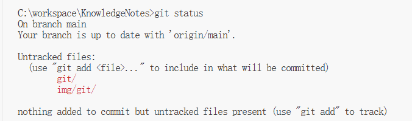
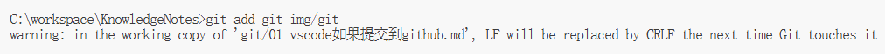
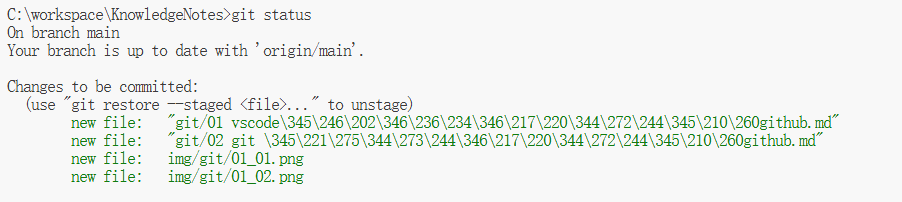
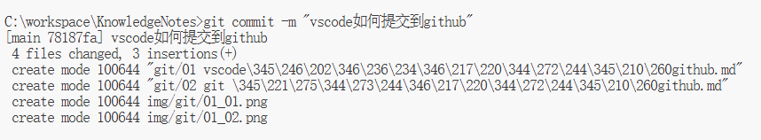
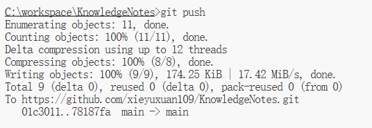

### 查看文件状态
```
git status
```

### 提交指定文件到暂存区
```
git add git img/git
```

### 再次查看文件状态
```
git status
```

### 提交到本地仓库
```
git commit -m "vscode如何提交到github"
```

### 提交到远程仓库
```
>git push
Enumerating objects: 11, done.
Counting objects: 100% (11/11), done.
Delta compression using up to 12 threads
Compressing objects: 100% (8/8), done.
Writing objects: 100% (9/9), 174.25 KiB | 17.42 MiB/s, done.
Total 9 (delta 0), reused 0 (delta 0), pack-reused 0 (from 0)
To https://github.com/xieyuxuan109/KnowledgeNotes.git
   01c3011..78187fa  main -> main
```
