# 创建微服务架构
### 版本选择
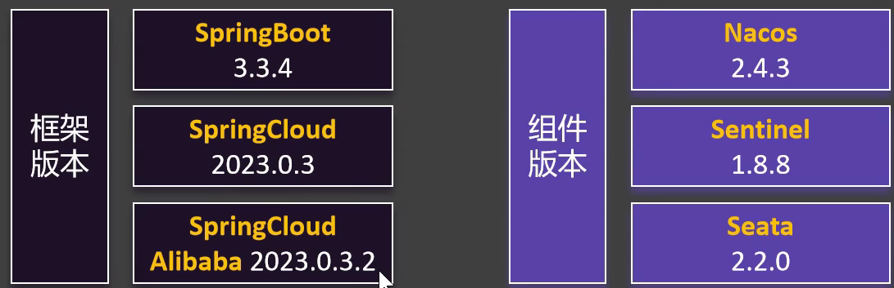

### 项目结构
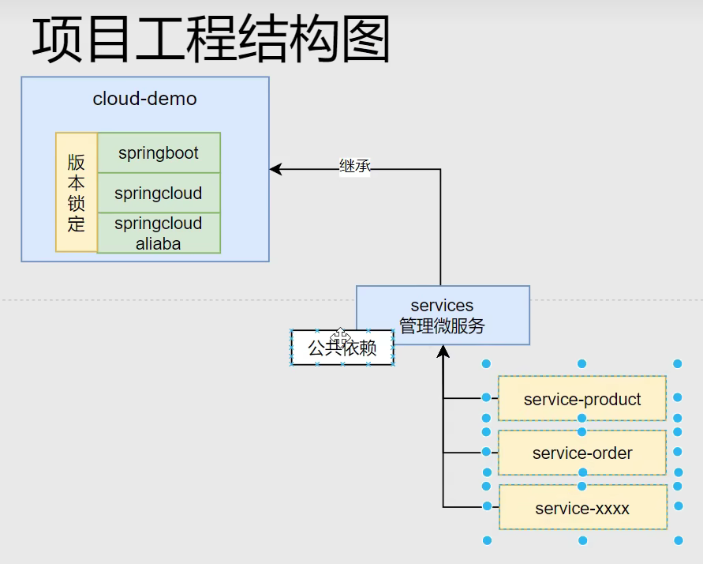

## 父项目
### 初始化项目
```
注意选择springboot，maven工程
```
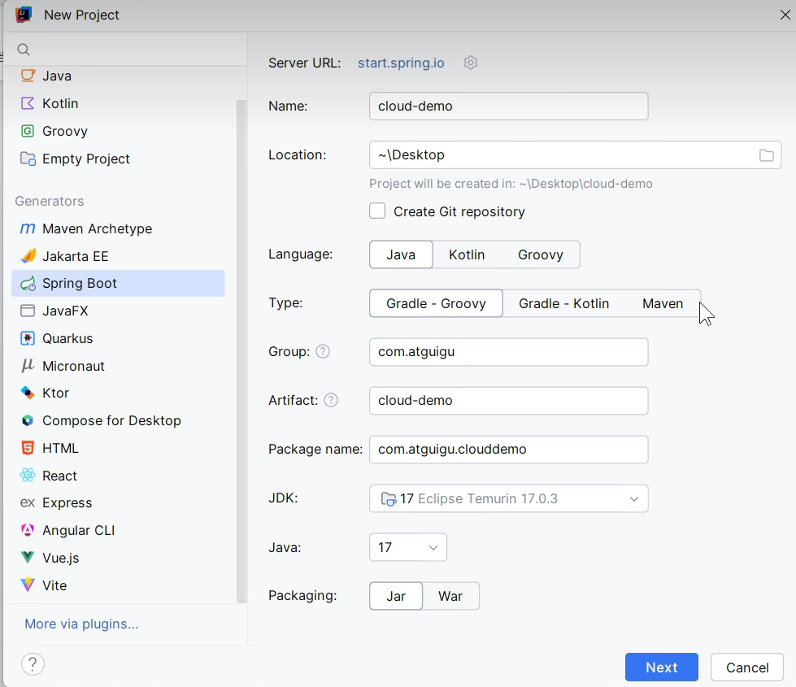

### 删除不重要的文件
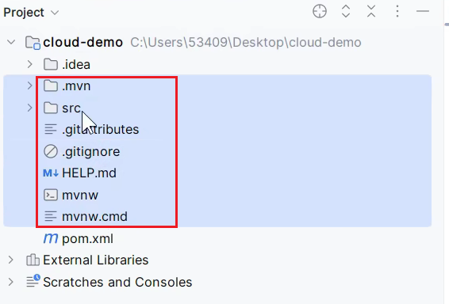

### 改变打包方式
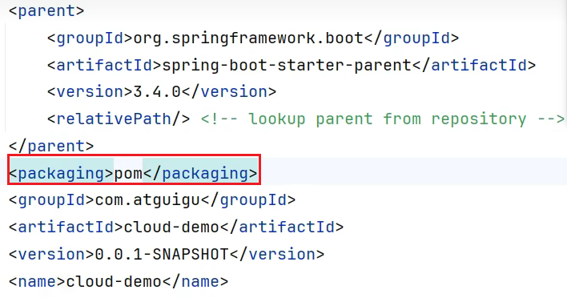

### 删除没用的（xml中）


### 版本控制
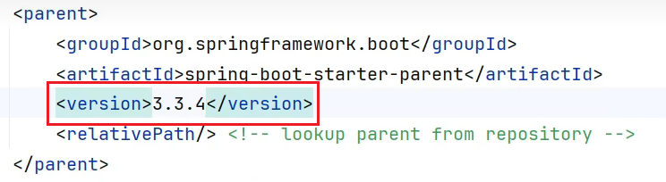

### 修改properities
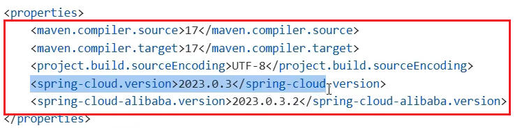

### 修改dependencyManagement
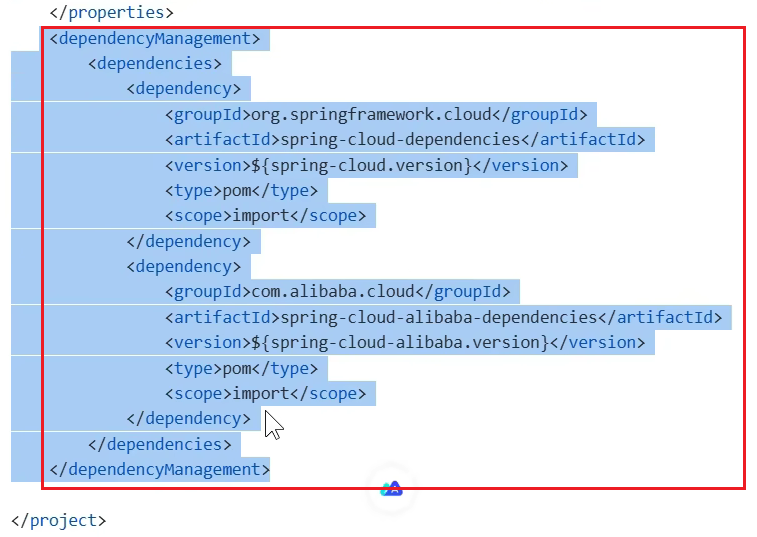

## 子项目

### 子项目创建
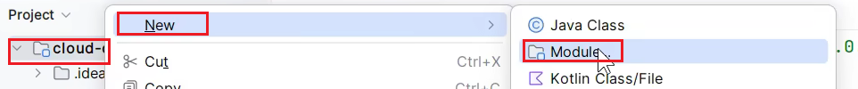
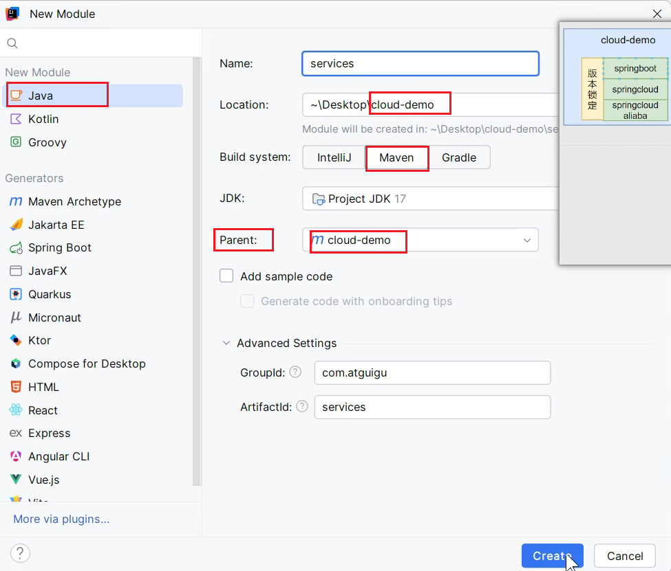

### 查看项目关系，改变打包方式
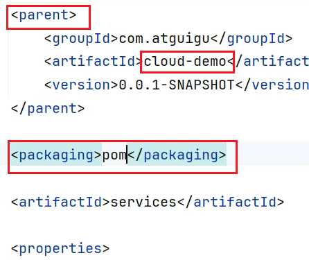

### 同理创建微服务
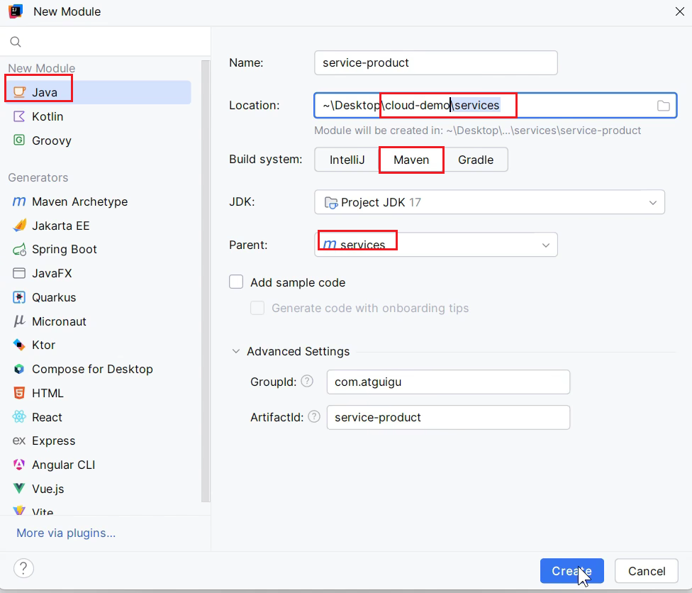

### 查看项目之间的关系
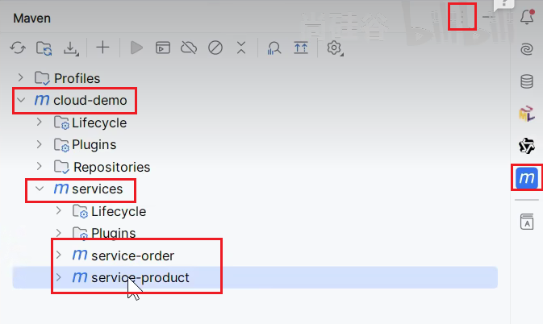

### 导入每个微服务都要用的依赖如注册中心等
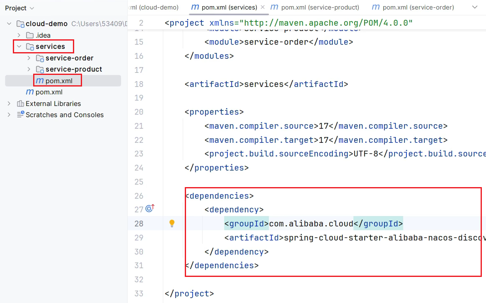